## TAREA EVALUABLE 2.1. TRABAJO CON GIT (Visual Studio Code)
### 1. Crear repositorio local y subir a GITHUB

1. Crea una carpeta llamada `UT2.1.a`.<br>
 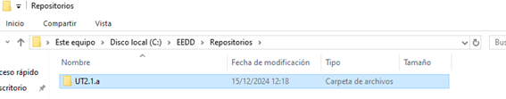<br>
2. Inicializa un repositorio local en la carpeta `UT2.1.a`. `adjunta la imagen`<br>
 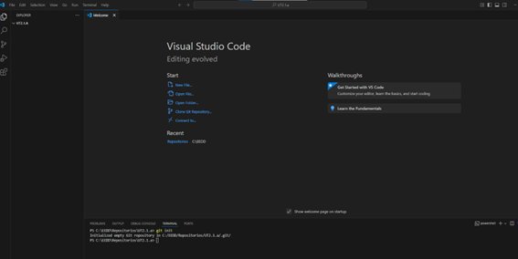<br>
  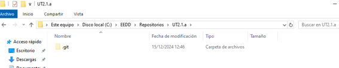<br>

3. Revisa qué rama se ha creado por defecto. ¿Desde dónde los visualizas? `adjunta la imagen`<br>
 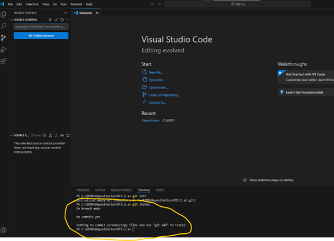<br>

4. Renombrar la rama por defecto a `main` en caso de que tenga otro nombre. `adjunta un gif`
 
Al estar en main, nos saltamos el paso. Se cambiaria usando git Branch -m new name.
   
5. Agrega un fichero `README.md`.

   ```markdown
   # UT2.1.a

   Repositorio de prueba para la tarea 2.1.a
   ```
 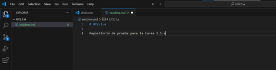<br>
6. Agrega el fichero `README.md` al stage area. `adjunta un gif`<br>
    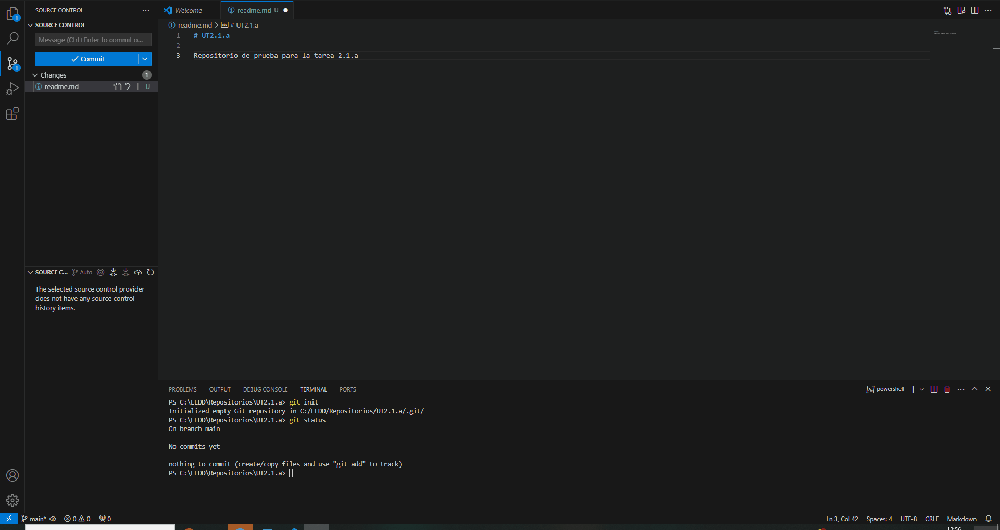<br>

7. Realiza un commit con el mensaje "Add README". `adjunta un gif`<br>
    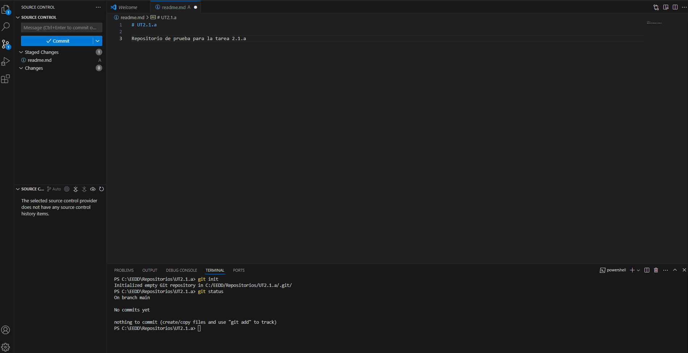<br>

8. Agrega otro fichero `01.xml` con siguiente texto.

   ```xml
   <?xml version="1.0" encoding="UTF-8"?>
   <libreria>
       <libro>
           <titulo>El Quijote</titulo>
           <autor>Miguel de Cervantes</autor>
           <editorial>Editorial Castalia</editorial>
           <fecha>1605</fecha>
           <genero>Novela</genero>
           <precio>20</precio>
       </libro>
   </libreria>
   ```

 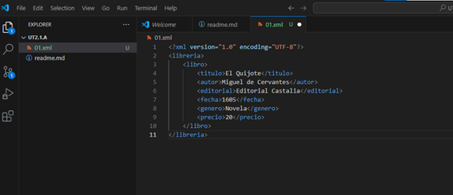<br>
9.  Agrega el fichero `01.xml` al stage area y realiza el commit "Add file 01.xml" `adjunta un gif`<br>
      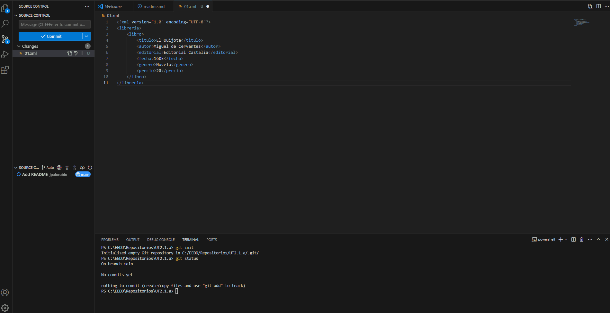<br>

10. Agrega una nueva rama llamada `fea/wac01` con la ayuda git-graph. `adjunta un gif`<br>
        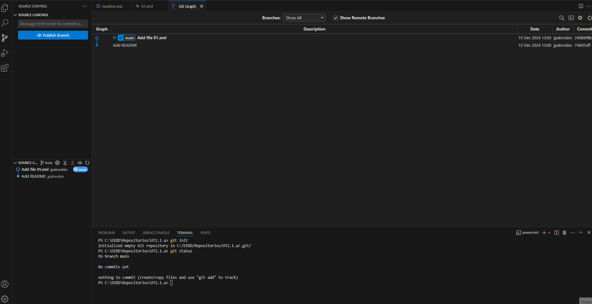<br>
11. En qué rama estas ahora mismo? ¿Cómo sabes en qué rama estás? `adjunta la imagen` y explica en breves palabras.
    ```text
    // Respuesta
    Podemos ver en que rama estamos en la parte inferior de la pantalla o desde git graph la que tiene el circulito. Para cambiarnos hacemos doble click en la rama que queramos entrar.
    ``` 
 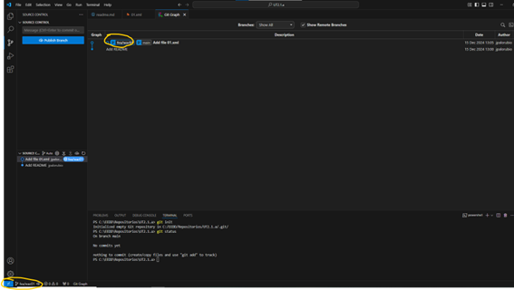<br>
12. Estando en la rama `fea/wac01` agrega un fichero `02.xml`, y agrega al área de stage y realiza commit "Add file 02". `adjunta un gif`<br>

    ```xml
    <?xml version="1.0" encoding="UTF-8"?>
    <libreria>
        <libro>
            <titulo>El Hobbit</titulo>
            <autor>J.R.R. Tolkien</autor>
            <editorial>Minotauro</editorial>
            <fecha>1937</fecha>
            <genero>Fantasía</genero>
            <precio>15</precio>
        </libro>
    </libreria>
    ```
 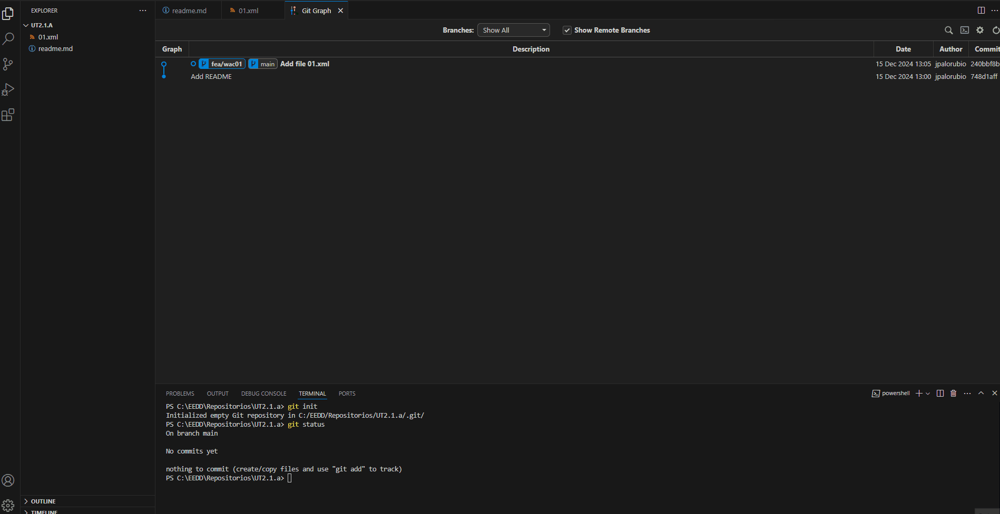<br>
13. Muestra el log (pantalla de git-graph donde se visualize el commit). `adjunta la imagen`<br>
   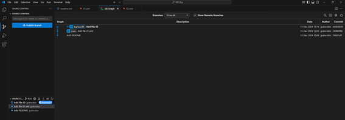<br>

14. Posicionate de nuevo en la rama `main`, y crea otra rama `fea/wac02`, posicionandote directamente en ella. Agrega un fichero `03.xml`, agrega al área de stage y realiza commit "Add file 03".

    ```xml
    <?xml version="1.0" encoding="UTF-8"?>
    <libreria>
        <libro>
            <titulo>El Señor de los Anillos</titulo>
            <autor>J.R.R. Tolkien</autor>
            <editorial>Minotauro</editorial>
            <fecha>1954</fecha>
            <genero>Fantasía</genero>
            <precio>25</precio>
        </libro>
    </libreria>
    ```
    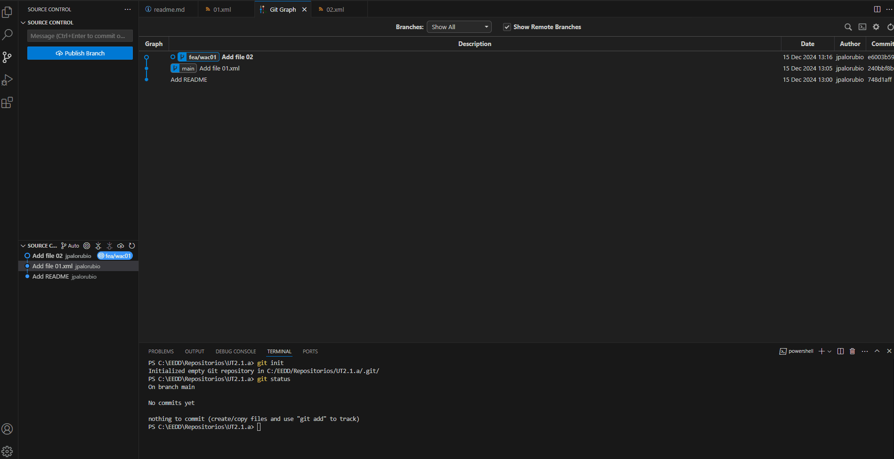<br>
15. Posicionate en la rama `main` y muestra los ficheros que hay en el directorio. (mostrar el arból de directorios de VS Code). `adjunta la imagen`<br>
      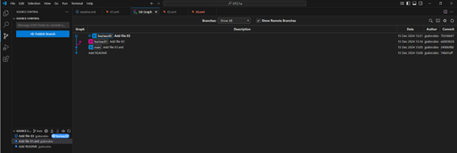<br>

16. Realizar un merge de la rama `fea/wac01` en la rama `main`. `adjunta un gif`<br>
     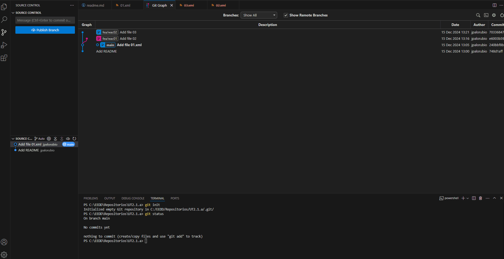<br>

17. Muestra el el log, y los ficheros que hay en el directorio. (mostrar el arból de directorios de VS Code) `adjunta la imagen`
   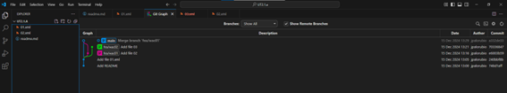<br>
    
18. Elimina la rama `fea/wac01` sin posibilidad de recuperación. `adjunta un gif`<br>
    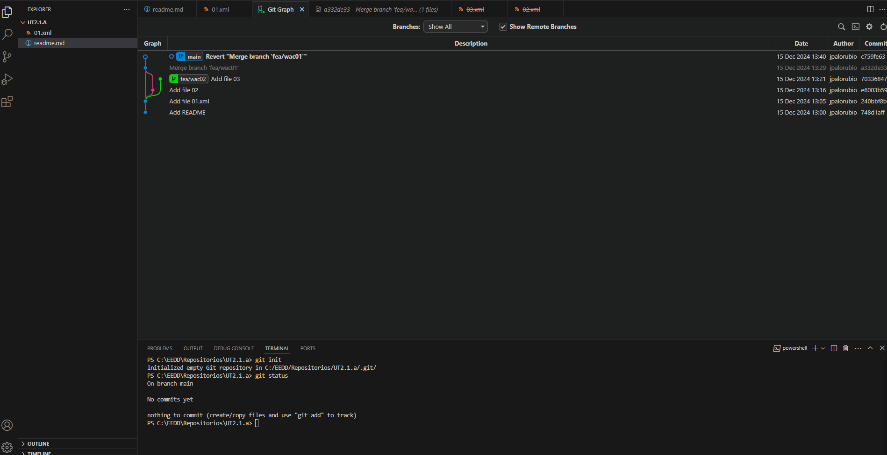<br>

19. Realiza un merge de la rama `fea/wac02` en la rama `main`. `adjunta un gif`<br>
  <br>
  
20. Muestra el log, y los ficheros que hay en el directorio. (Imagen) `adjunta la imagen`
   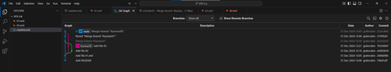<br>

21. Vuelve a la rama `fea/wac02` y modifica el fichero `03.xml` añadiendo un nuevo libro.
    
    ```xml
    <?xml version="1.0" encoding="UTF-8"?>
    <libreria>
        <libro>
            <titulo>El Señor de los Anillos</titulo>
            <autor>J.R.R. Tolkien</autor>
            <editorial>Minotauro</editorial>
            <fecha>1954</fecha>
            <genero>Fantasía</genero>
            <precio>25</precio>
        </libro>
        <libro>
            <titulo>El Silmarillion</titulo>
            <autor>J.R.R. Tolkien</autor>
            <editorial>Minotauro</editorial>
            <fecha>1977</fecha>
            <genero>Fantasía</genero>
            <precio>25</precio>
        </libro>
    </libreria>
    ```

    Agrega al área de stage y realiza commit "Update 03 file. Add book El Silmarillion".<br>
    `adjunta un gif, donde se visualize el contenido del fichero y el commit`<br>
   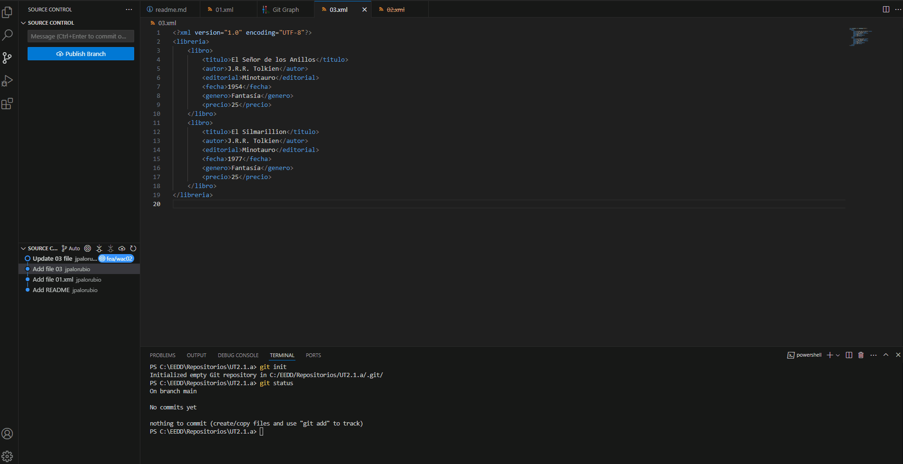<br>

22. Realiza un merge de la rama `fea/wac02` en la rama `main`. `adjunta un gif`<br>
 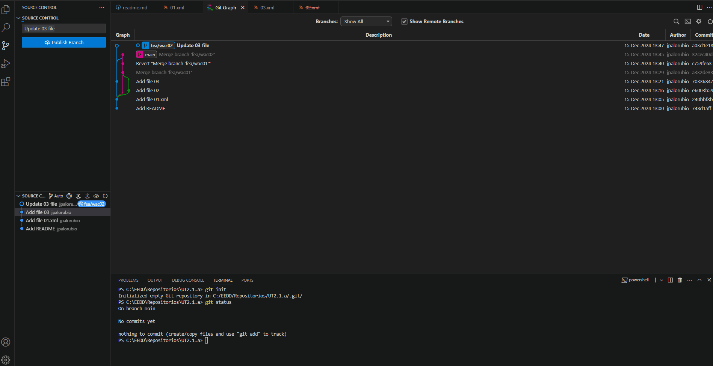<br>

23. Muestra el log del repositorio, y muestra el contenido del fichero `03.xml`. (Imagen visualizando comandos) `adjunta gif`
   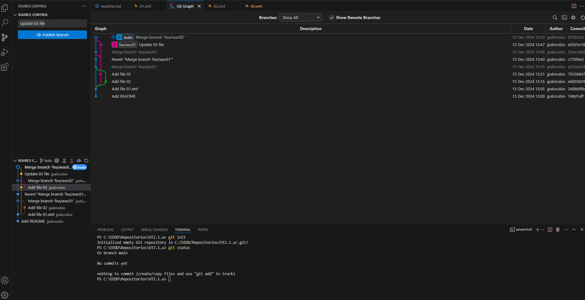<br>

24. Ahora, en la rama `main` modifica el fichero `03.xml` incluyendo un nuevo libro.

    ```xml
    <?xml version="1.0" encoding="UTF-8"?>
    <libreria>
        <libro>
            <titulo>El Señor de los Anillos</titulo>
            <autor>J.R.R. Tolkien</autor>
            <editorial>Minotauro</editorial>
            <fecha>1954</fecha>
            <genero>Fantasía</genero>
            <precio>25</precio>
        </libro>
        <libro>
            <titulo>El Silmarillion</titulo>
            <autor>J.R.R. Tolkien</autor>
            <editorial>Minotauro</editorial>
            <fecha>1977</fecha>
            <genero>Fantasía</genero>
            <precio>25</precio>
        </libro>
        <libro>
            <titulo>El Hobbit</titulo>
            <autor>J.R.R. Tolkien</autor>
            <editorial>Minotauro</editorial>
            <fecha>1937</fecha>
            <genero>Fantasía</genero>
            <precio>15</precio>
        </libro>
    </libreria>
    ```

    Agrega al área de stage y realiza commit "Update 03 file. Add book El Hobbit".<br>
    `adjunta un gif, donde se visualize el contenido del fichero y el commit`<br>
 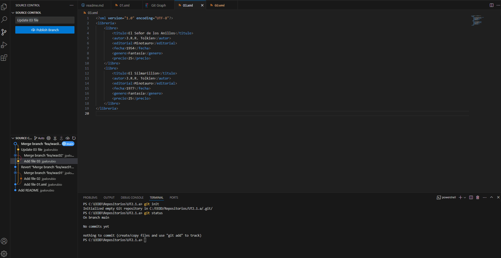<br>

25. Agrega un nuevo fichero `04.xml` sobre libros ciencia-ficcion, en la rama `main`.

    ```xml
    <?xml version="1.0" encoding="UTF-8"?>
    <libreria>
        <libro>
            <titulo>El fin de la eternidad</titulo>
            <autor>Isaac Asimov</autor>
            <editorial>Edhasa</editorial>
            <fecha>1955</fecha>
            <genero>Ciencia ficción</genero>
            <precio>20</precio>
        </libro>
    </liberia>
    ```

    Agrega al área de stage y realiza commit "Add 04 file. Add cienca-ficcion books".<br>
 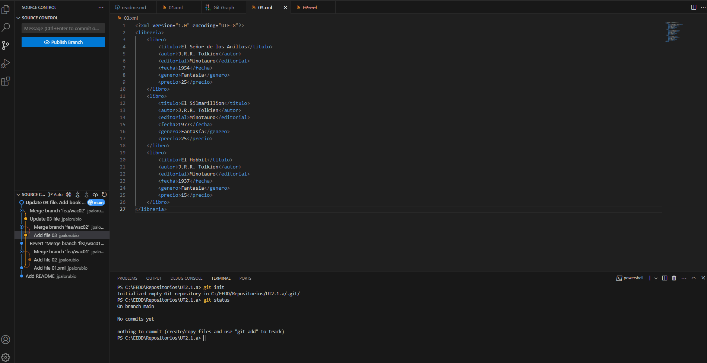<br>
26. Muestra el registro de commits (log) y los ficheros que hay en el directorio. `adjunta una imagen`<br>
   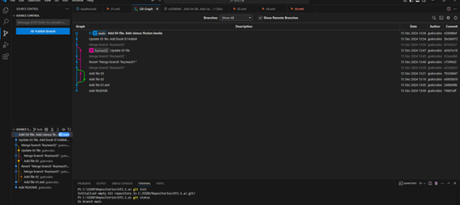<br>
27. Vuelve un commit atrás, y muestra el log y los ficheros que hay en el directorio. `adjunta un gif`<br>
    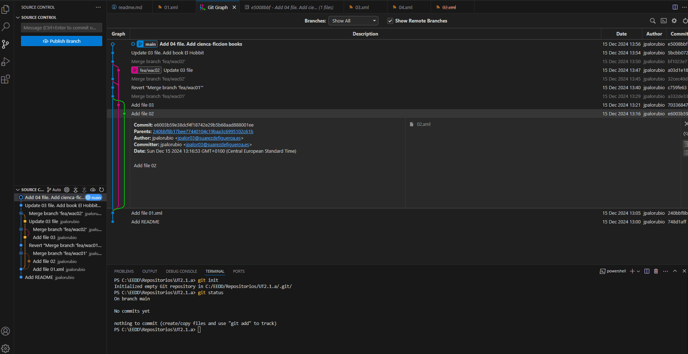<br>
    
28. Vuelve al commit anterior, y muestra el log y los ficheros que hay en el directorio. `adjunta un gif`<br>
     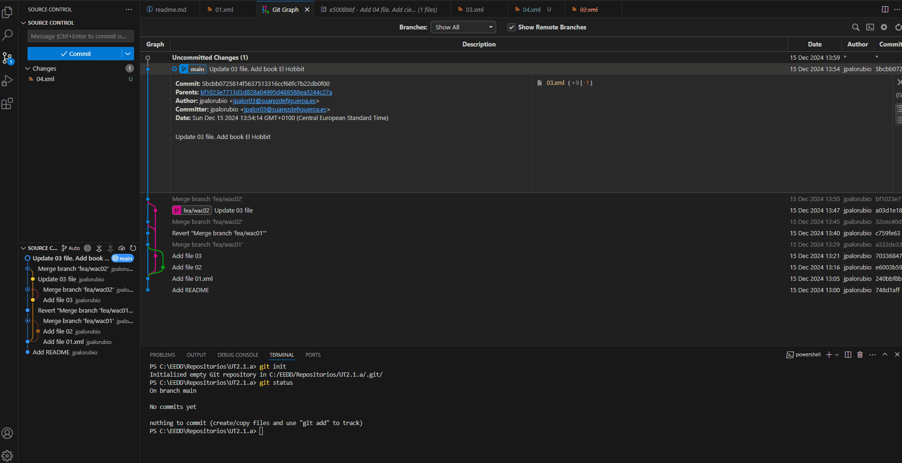<br>

29. Posicionate de nuevo en el último commit, y muestra el log y los ficheros que hay en el directorio. `adjunta un gif`
   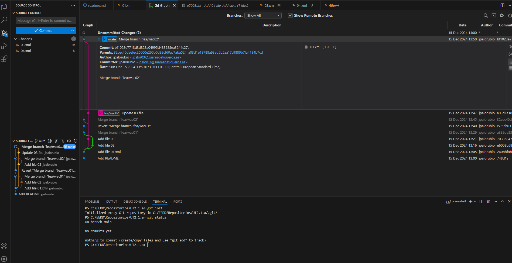<br>

### 2. Crear repositorio remoto y subir a GITHUB

1. Crea un repositorio remoto en GITHUB llamado `EEDD_{NombreApellido}_TE2.1` público, vacio, sin nada.
   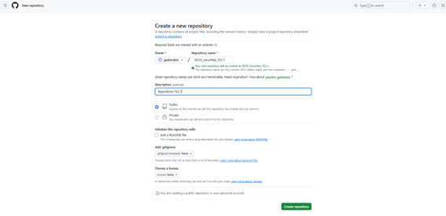<br>
2. Agrega el repositorio remoto a tu repositorio local. Explica cómo lo haces, y `adjunta una imagen donde se visualizen las url's`<br>
   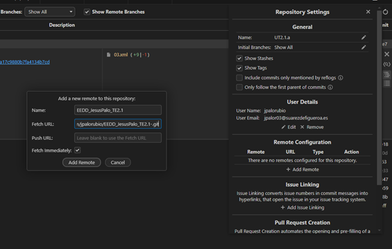<br>

   ```text
   Desde git graph nos vamos a Repository setting y le damos a Add Remote.
    
    ``` 

3. Sube la rama `main` al repositorio remoto. `adjunta un gif`<br>
   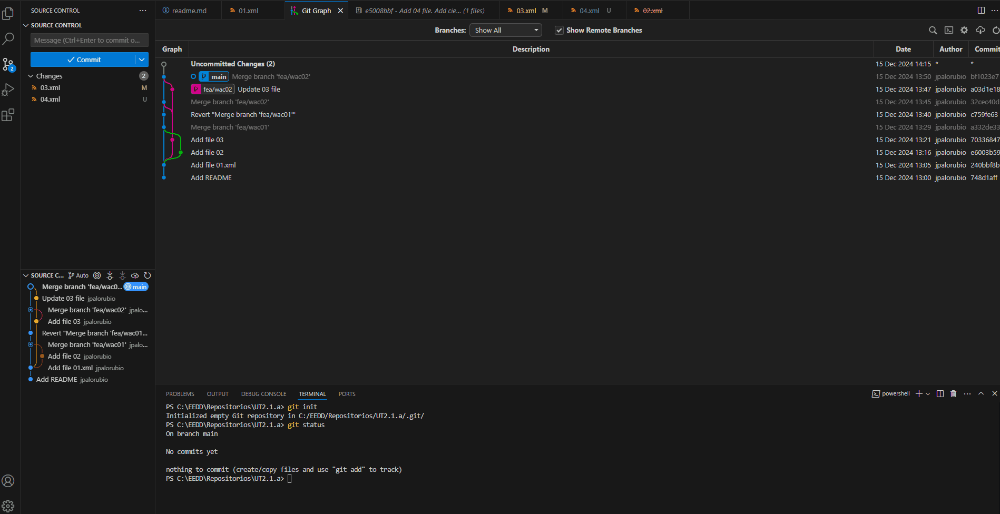<br>
   

4. Posicionate en la rama `fea/wac02` y sube la rama `fea/wac02` al repositorio remoto. `adjunta un gif`<br>
        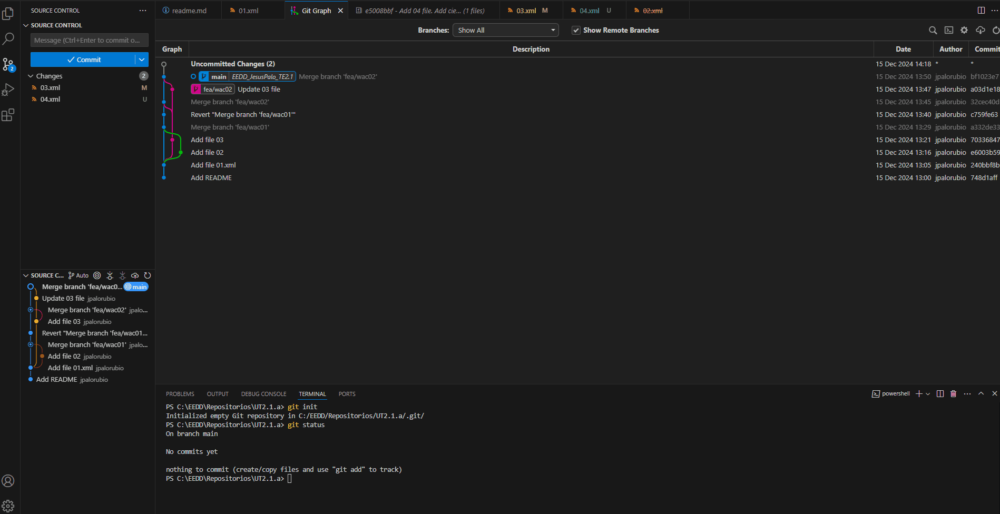<br>

5. Ahora desde GITHUB (web) en la rama `fea\wac02`, modifica el fichero `03.xml` añadiendo un nuevo libro.

   ```xml
   <?xml version="1.0" encoding="UTF-8"?>
   <libreria>
       <libro>
           <titulo>El Señor de los Anillos</titulo>
           <autor>J.R.R. Tolkien</autor>
           <editorial>Minotauro</editorial>
           <fecha>1954</fecha>
           <genero>Fantasía</genero>
           <precio>25</precio>
       </libro>
       <libro>
           <titulo>El Silmarillion</titulo>
           <autor>J.R.R. Tolkien</autor>
           <editorial>Minotauro</editorial>
           <fecha>1977</fecha>
           <genero>Fantasía</genero>
           <precio>25</precio>
       </libro>
       <libro>
           <titulo>El Hobbit</titulo>
           <autor>J.R.R. Tolkien</autor>
           <editorial>Minotauro</editorial>
           <fecha>1937</fecha>
           <genero>Fantasía</genero>
           <precio>15</precio>
       </libro>
       <libro>
           <titulo>El hombre bicentenario</titulo>
           <autor>Isaac Asimov</autor>
           <editorial>Edhasa</editorial>
           <fecha>1976</fecha>
           <genero>Ciencia ficción</genero>
           <precio>20</precio>
   </libreria>
   ```

   Realiza un commit con el mensaje "Update 03 file. Add book El hombre bicentenario".
   (Muestra pantallazo de GITHUB con el commit realizado) `adjunta la imagen`
        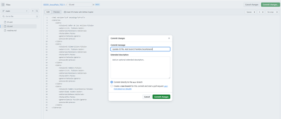<br>

7. Ahora obten los cambios sin acualizar el repositorio local (`git fetch origin`).<br>
   Muestra el log del repositorio local `adjunta la imagen`
    
8.  Ahora actualiza el repositorio local con los cambios del repositorio remoto (`git pull`) y muestra el log. `adjunta un gif`<br>
     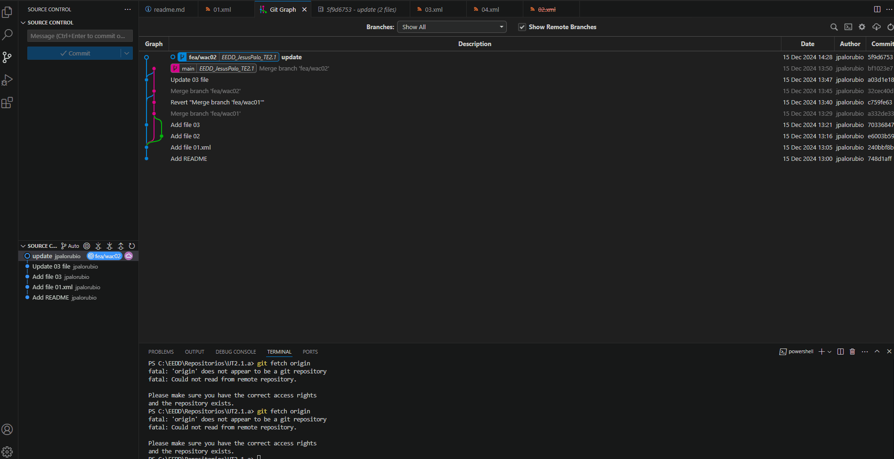<br>
9.  Haz un merge de la rama `fea/wac02` en la rama `main`. Muestra estado, log, y el contenido fichero `03.xml` (Incluye imagen) `adjunta un gif`<br>
       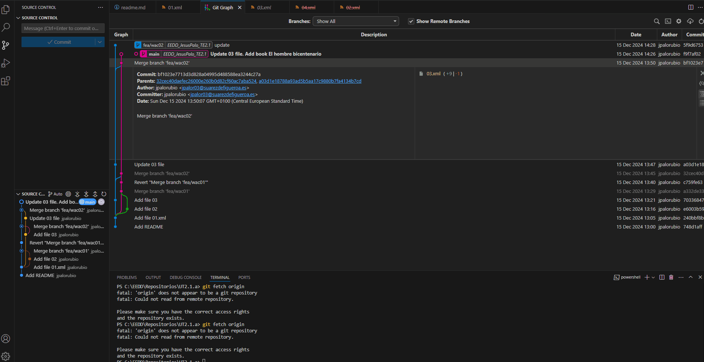<br>

10.  Sube la rama `main` al repositorio remoto. `adjunta una gif`<br>
       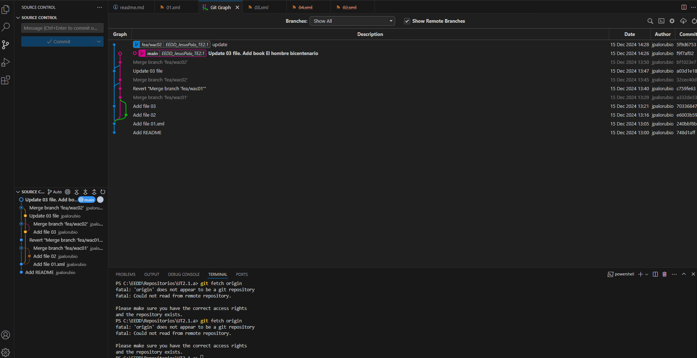<br>
11. Elimina la rama local `fea/wac02` sin posibilidad de recuperación. `adjunta un gif`<br>
      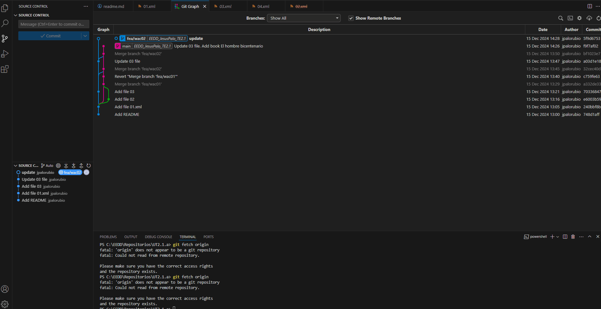<br>

12. Elimina la rama remota `fea/wac02` sin posibilidad de recuperación 
    ```text
    // Respuesta
    
    ```
     <br>
13. Muestra desde GITHUB (navegador web) las ramas que tienes el en repositorio remoto. `adjunta un gif`<br>
    

14. Para finalizar, muestra el log del repositorio local (Incluye imagen) `adjunta la imagen`<br>
    

### 3. Enlace repositorio remoto

1. Incluye el enlace al repositorio remoto en este punto para que el profesor pueda acceder a él.
   ```text
    // Enlace al repositorio remoto (en que aparece en la URL del navegador)
    
    ``` 
